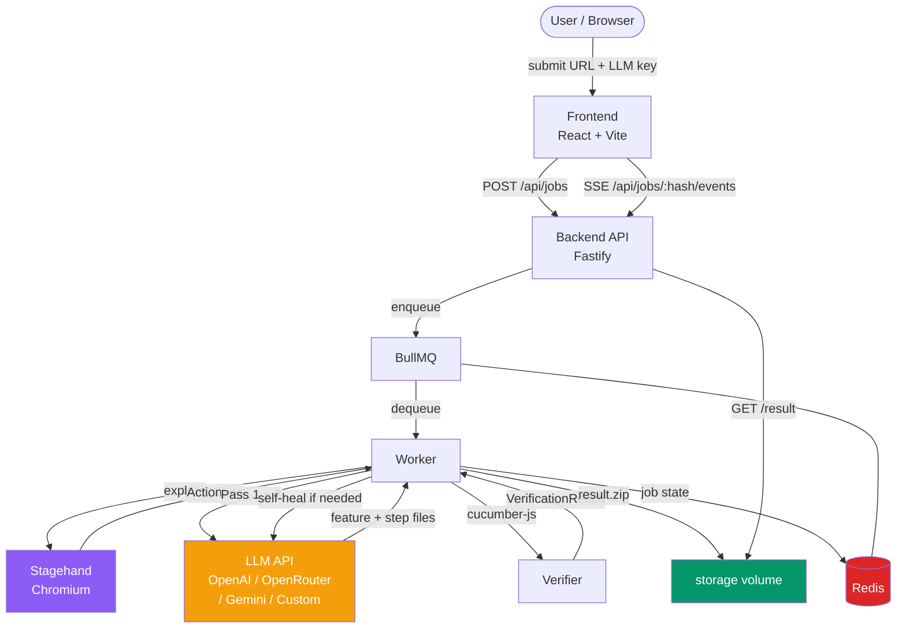
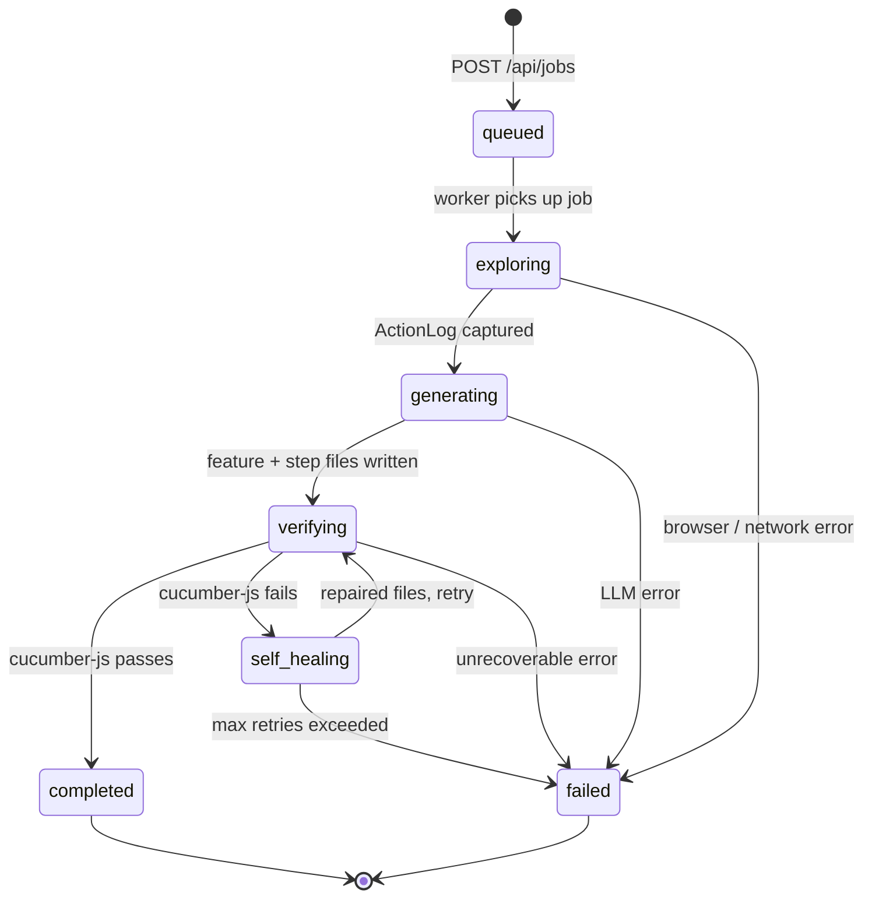
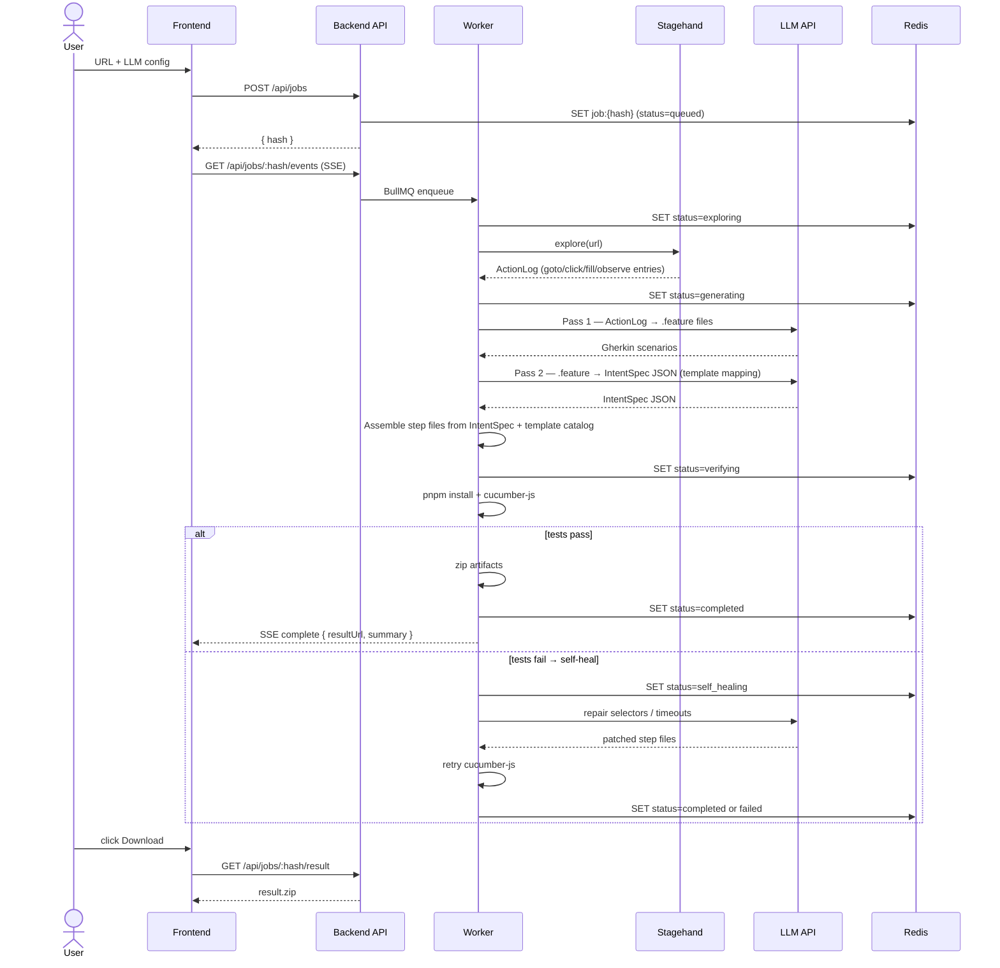
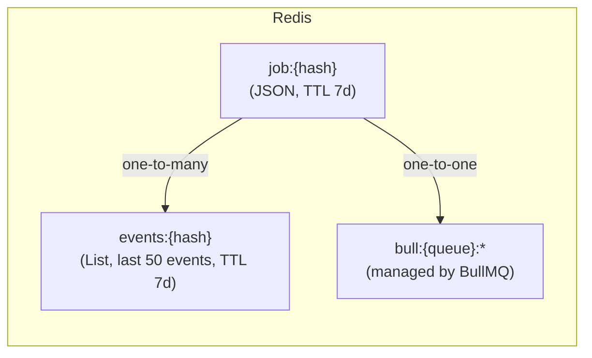
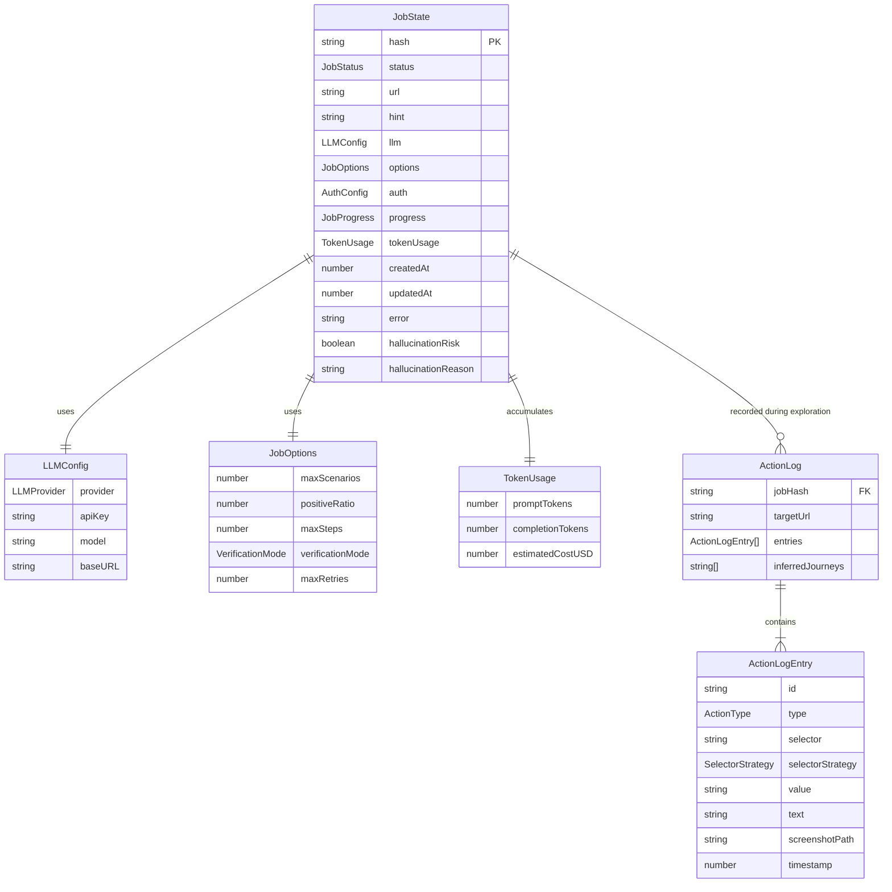
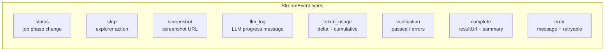

# PickleScout

> LLM-driven browser agent that explores your web app and generates a ready-to-run **Cucumber.js + Playwright** test project.

**Browse once, test forever.**

[中文版 README](README.zh-TW.md)

---

## What it does

1. **Explore** — Stagehand (Playwright + LLM) navigates your app and records an `ActionLog` of every interaction.
2. **Generate** — Two-pass LLM pipeline converts the `ActionLog` into Gherkin `.feature` files and TypeScript Playwright step definitions.
3. **Verify** — Generated tests are run once with `cucumber-js` inside the backend. If they fail, a self-healing LLM call attempts selector and timeout fixes.
4. **Package** — Everything is zipped into a standalone project you can drop into any CI/CD pipeline — zero LLM dependency at runtime.

---

## Architecture



### Service responsibilities

| Service | Tech | Role |
|---------|------|------|
| Frontend | React 18 + Vite 5 + TypeScript | Job submission, real-time SSE display, zip download |
| Backend | Fastify 4 + Node 20 + TypeScript | REST API, SSE proxy, BullMQ worker host |
| Redis | Redis 7 | Job state store, SSE event buffer, BullMQ queue |
| Stagehand | Playwright + LLM | Browser exploration — **generation phase only** |
| Storage | Docker volume `/storage` | Screenshots, action logs, generated zips |

---

## Pipeline state machine



---

## Data flow (sequence)



---

## Data model

### Redis key schema



| Key pattern | Type | TTL | Contents |
|---|---|---|---|
| `job:{hash}` | String (JSON) | 7 days | Full `JobState` — status, LLM config, token usage, error, hallucination flags |
| `events:{hash}` | List (JSON) | 7 days | Last 50 `StreamEvent` objects for SSE replay on reconnect |
| `bull:*` | Various | BullMQ-managed | Queue internals |

### JobState schema



### SSE event types



---

## Generated output structure

Every job produces a self-contained zip:

```
generated-tests/
├── features/
│   ├── 01_login_flow.feature
│   └── 02_sales_order.feature
├── steps/
│   ├── common.steps.ts        ← shared navigation + login steps
│   ├── 01_login_flow.steps.ts
│   └── 02_sales_order.steps.ts
├── support/
│   ├── world.ts               ← Cucumber World (Playwright page context)
│   └── hooks.ts               ← Before/After browser lifecycle
├── cucumber.js                ← Cucumber config
├── playwright.config.ts
├── package.json               ← exact-pinned: @cucumber/cucumber@11.0.0, @playwright/test@1.60.0
├── tsconfig.json
├── .github/workflows/e2e.yml  ← ready-to-use GitHub Actions workflow
├── .env.example
└── README.md
```

---

## Quick start

### Prerequisites

- Docker + Docker Compose
- An API key for one of: OpenAI, OpenRouter, Google Gemini, or any OpenAI-compatible endpoint

### Run locally

```bash
git clone https://github.com/iskWang/PickleScout
cd picklescout
docker compose up
```

Open [http://localhost:5173](http://localhost:5173).

### Run the generated tests

```bash
unzip result.zip -d my-tests
cd my-tests
npm install
npx playwright install chromium --with-deps
cp .env.example .env   # set BASE_URL, APP_USER, APP_PASS
npm test
```

---

## Configuration

| Field | Description | Default |
|---|---|---|
| **URL** | Target web app to explore | — |
| **Hint** | Optional plain-language description of key user flows | — |
| **LLM Provider** | `openai` · `openrouter` · `gemini` · `custom` | — |
| **Model** | Any model supported by the provider | — |
| **Max scenarios** | Total Gherkin scenarios to generate | 10 |
| **Positive ratio** | Fraction of happy-path vs negative scenarios | 0.8 |
| **Verification mode** | `syntax-only` · `smoke` · `full` | `smoke` |
| **Auth** | Optional form-based login (URL, username, password, selectors) | — |

### Supported LLM providers

| Provider | Notes |
|---|---|
| OpenAI | `gpt-4o`, `gpt-4o-mini`, etc. |
| OpenRouter | Any model on openrouter.ai |
| Google Gemini | Via OpenAI-compatible endpoint |
| Custom | Any OpenAI-compatible base URL |

> **Note:** Anthropic (Claude) is supported for exploration (via OpenRouter) but not directly — the OpenAI SDK is used for generation and self-healing.

---

## Self-test

After modifying any worker file, run the built-in pipeline smoke test:

```bash
./scripts/self-test.sh           # smoke — happy path
./scripts/self-test.sh negative  # hallucination guard
./scripts/self-test.sh all       # both
```

See [`.agents/self-test.md`](.agents/self-test.md) for assertion semantics and failure mode lookup table.

---

## Development

```bash
# Start all services
docker compose up

# Frontend only (hot-reload)
pnpm dev:frontend

# Backend only (ts-node-dev watch)
pnpm dev:backend

# Typecheck all workspaces
pnpm -r typecheck

# Lint
pnpm -r lint

# Unit tests
pnpm -r test
```

### Monorepo layout

```
packages/
  shared/    # @picklescout/shared — types shared by frontend + backend
  frontend/  # React + Vite
  backend/   # Fastify + Stagehand + BullMQ
.agents/     # Agent context docs (architecture, specs, self-test)
scripts/     # self-test.sh
docs/        # PRD, progress log, LLM provider notes
```

---

## License

MIT
