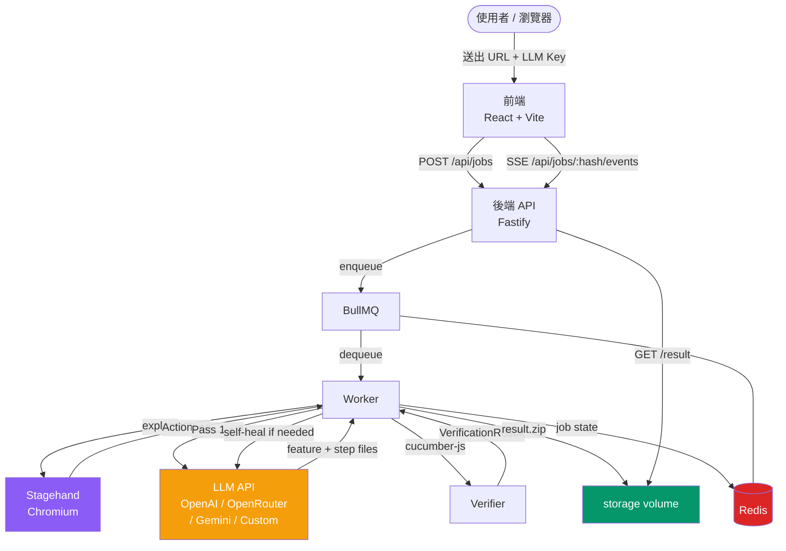
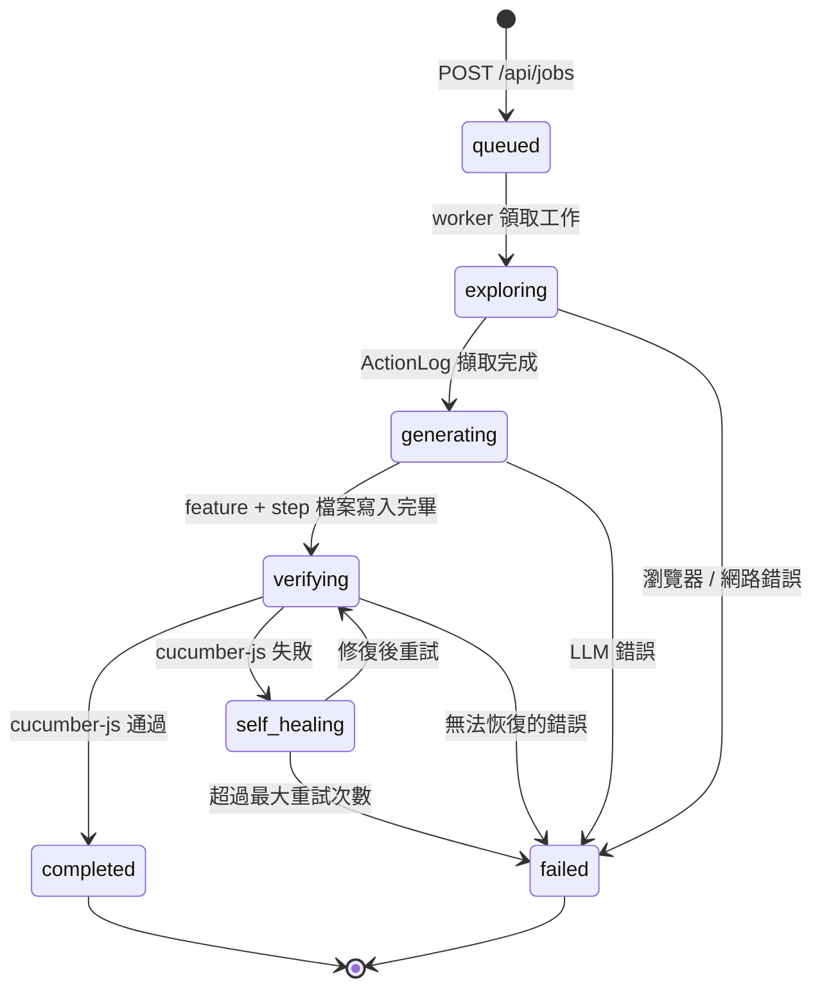
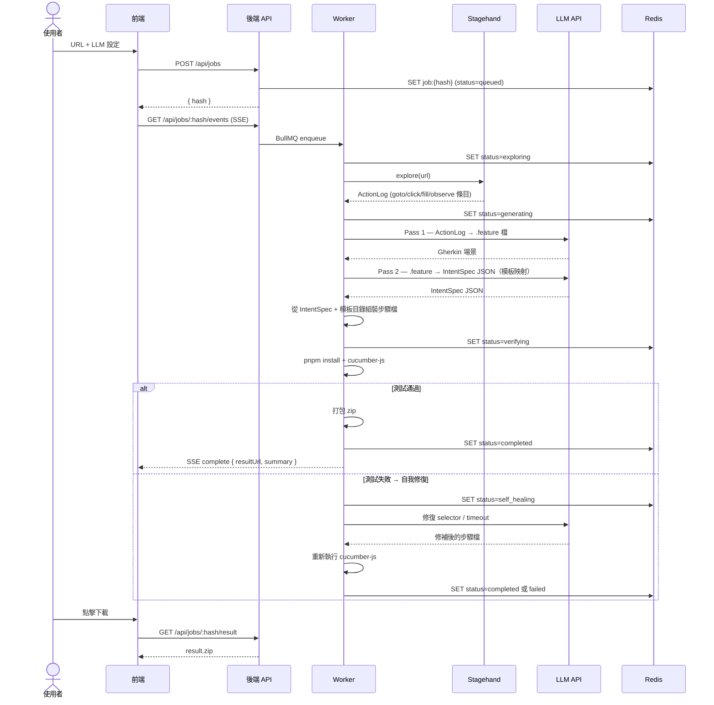

<div align="center">
  
  <br/>
  
</div>

# PickleScout

> LLM 驅動的瀏覽器代理人，自動探索你的 Web 應用並產生即用的 **Cucumber.js + Playwright** 測試專案。

**瀏覽一次，測試永遠。**

[English README](README.md)

<div align="center">
  <video src="demo.mp4" controls width="720" title="PickleScout Demo — 瀏覽一次，測試永遠"></video>
</div>

---

## 它做什麼

1. **探索** — Stagehand（Playwright + LLM）自動瀏覽你的應用，記錄每一個互動為 `ActionLog`。
2. **生成** — 雙階段 LLM 流水線將 `ActionLog` 轉換為 Gherkin `.feature` 檔與 TypeScript Playwright 步驟定義。
3. **驗證** — 在後端用 `cucumber-js` 執行一次生成的測試。若失敗，自我修復 LLM 呼叫會嘗試修正 selector 和 timeout。
4. **打包** — 所有檔案打包成獨立 zip，可直接放入任何 CI/CD 流水線——執行時零 LLM 依賴。

---

## 架構



### 服務職責

| 服務 | 技術 | 職責 |
|------|------|------|
| 前端 | React 18 + Vite 5 + TypeScript | 工作提交、即時 SSE 顯示、zip 下載 |
| 後端 | Fastify 4 + Node 20 + TypeScript | REST API、SSE 代理、BullMQ worker |
| Redis | Redis 7 | Job 狀態儲存、SSE 事件緩衝、BullMQ 佇列 |
| Stagehand | Playwright + LLM | 瀏覽器探索——**僅在生成階段使用** |
| Storage | Docker volume `/storage` | 截圖、action log、生成的 zip |

---

## 流水線狀態機



---

## 資料流（循序圖）



---

## 輸出結構

每個工作產生一個自包含的 zip：

```
generated-tests/
├── features/
│   ├── 01_login_flow.feature
│   └── 02_sales_order.feature
├── steps/
│   ├── 01_login_flow.steps.ts
│   └── 02_sales_order.steps.ts
├── support/
│   ├── world.ts               ← Cucumber World（Playwright page context）
│   └── hooks.ts               ← Before/After 瀏覽器生命週期
├── cucumber.js                ← Cucumber 設定
├── playwright.config.ts
├── package.json               ← 精確鎖版：@cucumber/cucumber@11.0.0、@playwright/test@1.60.0
├── tsconfig.json
├── .github/workflows/e2e.yml  ← 即用的 GitHub Actions workflow
├── .env.example
└── README.md
```

---

## 快速開始

### 前置需求

- Docker + Docker Compose
- 以下任一 LLM 的 API Key：OpenRouter 或任何 OpenAI 相容端點

### 本機執行

```bash
git clone https://github.com/iskWang/PickleScout
cd PickleScout
docker compose up
```

開啟 [http://localhost:5173](http://localhost:5173)。

### 執行生成的測試

```bash
unzip result.zip -d my-tests
cd my-tests
npm install
npx playwright install chromium --with-deps
cp .env.example .env   # 設定 BASE_URL、APP_USER、APP_PASS
npm test
```

---

## 設定參數

| 欄位 | 說明 | 預設 |
|------|------|------|
| **URL** | 目標 Web 應用的網址 | — |
| **Hint** | 可選的自然語言描述，說明主要使用者流程 | — |
| **LLM Provider** | `openrouter` · `custom` | — |
| **Model** | 該 provider 支援的任何模型 | — |
| **Max scenarios** | 生成的 Gherkin 場景總數上限 | 10 |
| **Positive ratio** | 正向路徑 vs 負向場景的比例 | 0.8 |
| **Verification mode** | `syntax-only` · `smoke` · `full` | `smoke` |
| **Auth** | 可選的表單登入（URL、帳號、密碼、selector） | — |

### 支援的 LLM Provider

| Provider | 說明 |
|---|---|
| OpenRouter | openrouter.ai 上的任何模型（目前主要測試 `google/gemini-3.1-flash-lite-preview`） |
| Custom | 任何 OpenAI 相容的 base URL |

> **注意：** OpenAI、Anthropic、Google Gemini 直接 API 支援尚在開發中，目前 UI 顯示為「coming soon」。

---

## 開發

```bash
# 啟動所有服務
docker compose up

# 前端（熱重載）
pnpm dev:frontend

# 後端（ts-node-dev watch）
pnpm dev:backend

# 所有 workspace typecheck
pnpm -r typecheck

# Lint
pnpm -r lint

# 單元測試
pnpm -r test
```

### Monorepo 結構

```
packages/
  shared/    # @picklescout/shared — 前後端共用型別
  frontend/  # React + Vite
  backend/   # Fastify + Stagehand + BullMQ
.agents/     # Agent context 文件（架構、規格、self-test）
scripts/     # self-test.sh
docs/        # PRD、進度日誌、LLM provider 說明
```

---

## License

MIT
